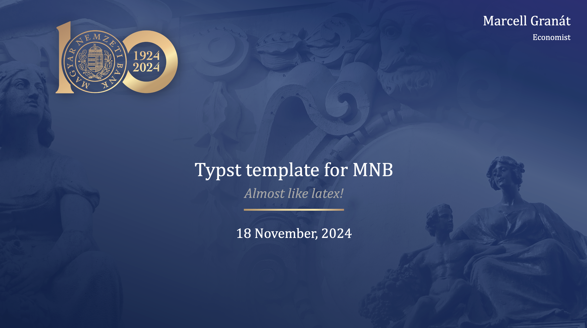

# Quarto-mnbhundred-Typst Format

A minimalistic presentation theme for Quarto + Typst + [Touying](https://touying-typ.github.io).



## Install


If you would like to add the mnbhundred theme to an existing directory:

```bash
quarto install extension marcellgranat/quarto-mnbhundred-typst
```

or you can use a Quarto template that bundles a .qmd starter file:


```bash
quarto use template marcellgranat/quarto-mnbhundred-typst
```

or just copy the files.


